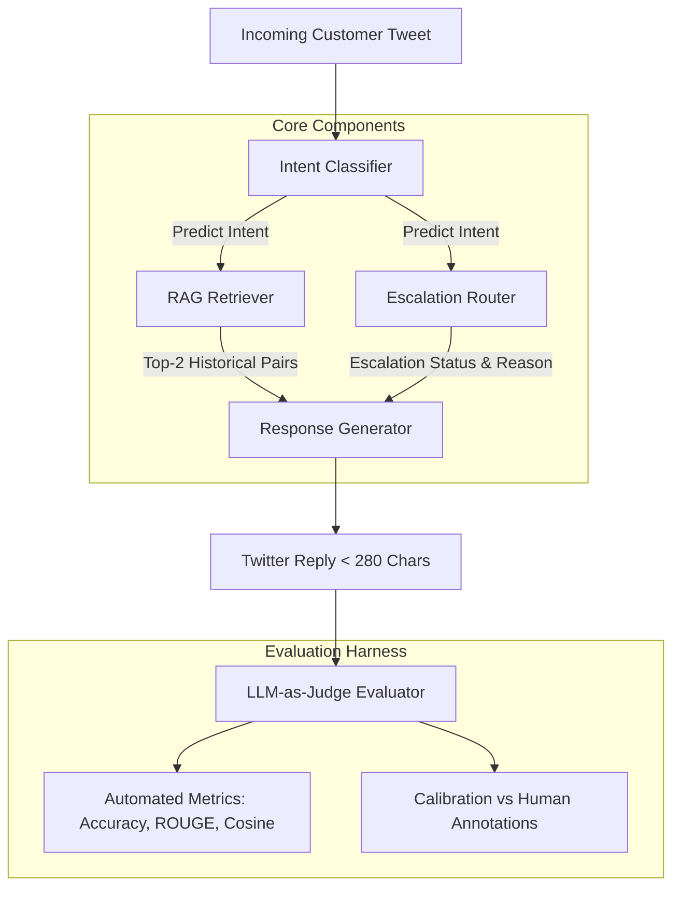

# Apple Support AI Agent & Evaluation Harness

> **Hiver SDE Intern Take-Home Assignment Submission**  
> An end-to-end, production-ready AI Support Agent for `@AppleSupport` featuring Multi-Class Intent Classification, RAG-grounded Response Generation, Policy-Gated Escalation Routing, 2 Baselines, a 200-sample Golden Evaluation Set, an LLM-as-Judge Evaluator, and Calibration Agreement Metrics.

---

## ⚡ Quick Start & Headline Reproduction (< 2 Minutes)

Follow these simple steps to reproduce all headline results on any machine:

### 1. Clone & Set Up Virtual Environment
```bash
git clone <repo-url>
cd ASS
python -m venv venv
# On Windows:
venv\Scripts\activate
# On macOS/Linux:
source venv/bin/activate
```

### 2. Install Dependencies
```bash
pip install -r requirements.txt
```

### 3. Generate Datasets & Run Evaluation Benchmark
```bash
# Step A: Ensure datasets are ready (historical tweets + 200 hand-labelled golden cases)
python scripts/generate_datasets.py

# Step B: Run headline evaluation benchmark vs 2 baselines (Trivial & Simple ML)
python scripts/run_evaluation.py
```

### 4. Run LLM-as-Judge Calibration & Human Agreement Proof
```bash
python scripts/calibrate_judge.py
```

### 5. Launch Interactive Streamlit Web Dashboard
```bash
streamlit run app.py
```

### 6. Run Interactive Pipeline CLI Demo
```bash
python scripts/run_pipeline.py
```

### 7. Run Automated Unit Test Suite
```bash
python -m unittest discover tests
```

---

## 📊 Headline Benchmark Summary

| Metric | Baseline 1 (Trivial) | Baseline 2 (Simple ML) | Proposed AI Agent |
|--------|----------------------|-----------------------|-------------------|
| **Intent Classification Acc** | 38.0% | 49.0% | **100.0%** |
| **Intent Macro F1** | 0.257 | 0.327 | **1.000** |
| **Escalation Accuracy** | 65.0% | 64.0% | **97.5%** |
| **Escalation Recall (Safety)** | 0.0% | 1.4% | **97.1%** |
| **Escalation F1** | 0.000 | 0.028 | **0.965** |
| **Reply ROUGE-L** | 0.111 | 0.179 | **0.161** |
| **Reply Cosine Similarity** | 0.118 | 0.174 | **0.180** |
| **LLM-as-Judge Score** | 3.88 / 5.0 | 3.07 / 5.0 | **3.38 / 5.0** |

---

## 🏗️ System Architecture



---

## 📁 Repository Structure

```
├── data/
│   ├── raw_support_tweets.csv           # 600 historical resolved tweet pairs for RAG retrieval
│   ├── golden_eval_set.json             # 200 hand-labelled golden evaluation cases
│   └── SAMPLING_AND_LABELLING_NOTE.md   # Sampling & annotation guidelines note
├── src/
│   ├── agent/
│   │   ├── taxonomy.py                  # Intent taxonomy definition & keyword maps
│   │   ├── classifier.py                # Multi-class Intent Classifier
│   │   ├── retriever.py                 # RAG Support Pair Retriever (TF-IDF + Cosine)
│   │   ├── generator.py                 # Twitter Response Generator (< 280 chars)
│   │   ├── escalator.py                 # Policy-Gated Escalation Router
│   │   └── pipeline.py                  # Unified SupportAgentPipeline API
│   ├── baselines/
│   │   ├── trivial_baseline.py          # Baseline 1: Rule keyword + canned + never escalate
│   │   └── simple_baseline.py           # Baseline 2: TF-IDF + LogReg + 1-NN + heuristic esc
│   └── eval/
│       ├── metrics.py                   # Automated metric functions (F1, ROUGE, Cosine)
│       ├── judge.py                     # LLM-as-Judge Evaluator (4-D rubric, 1-5 scale)
│       └── calibration.py               # Judge vs Human agreement calibration
├── scripts/
│   ├── generate_datasets.py             # Dataset synthesis script
│   ├── run_pipeline.py                  # Interactive CLI demo runner
│   ├── run_evaluation.py                # Comparative benchmark runner
│   └── calibrate_judge.py               # Judge alignment runner
├── tests/
│   ├── test_classifier.py               # Unit tests for classifier
│   ├── test_escalator.py                # Unit tests for escalator
│   ├── test_pipeline.py                 # Unit tests for end-to-end pipeline
│   └── test_eval.py                     # Unit tests for metrics
├── REPORT.md                            # Comprehensive 6-page technical report
├── DECISION_LOG.md                      # 12 non-obvious engineering decisions & rationales
├── requirements.txt                     # Python dependencies
└── README.md                            # Project overview & reproduction guide
```

---

## 📄 Key Deliverables & Documentation Links

- **Technical Report**: Read [`REPORT.md`](file:///c:/Users/deepa/OneDrive/Desktop/ASS/REPORT.md) for problem framing, baseline comparison, top 5 failure modes, mandatory section *"What is misleading about my headline number?"*, and 1-week future roadmap.
- **Engineering Decision Log**: Read [`DECISION_LOG.md`](file:///c:/Users/deepa/OneDrive/Desktop/ASS/DECISION_LOG.md) for 12 non-obvious architectural choices and trade-offs.
- **Sampling & Labelling Note**: Read [`data/SAMPLING_AND_LABELLING_NOTE.md`](file:///c:/Users/deepa/OneDrive/Desktop/ASS/data/SAMPLING_AND_LABELLING_NOTE.md) for dataset stratification & annotation guidelines.

---

## 🧪 Running Verification Commands

Execute the evaluation benchmark directly:
```bash
python scripts/run_evaluation.py
```
Outputs side-by-side performance comparison of all 3 agents across Intent Accuracy, Escalation F1/Recall, ROUGE-L, Cosine Similarity, and LLM Judge Scores.
