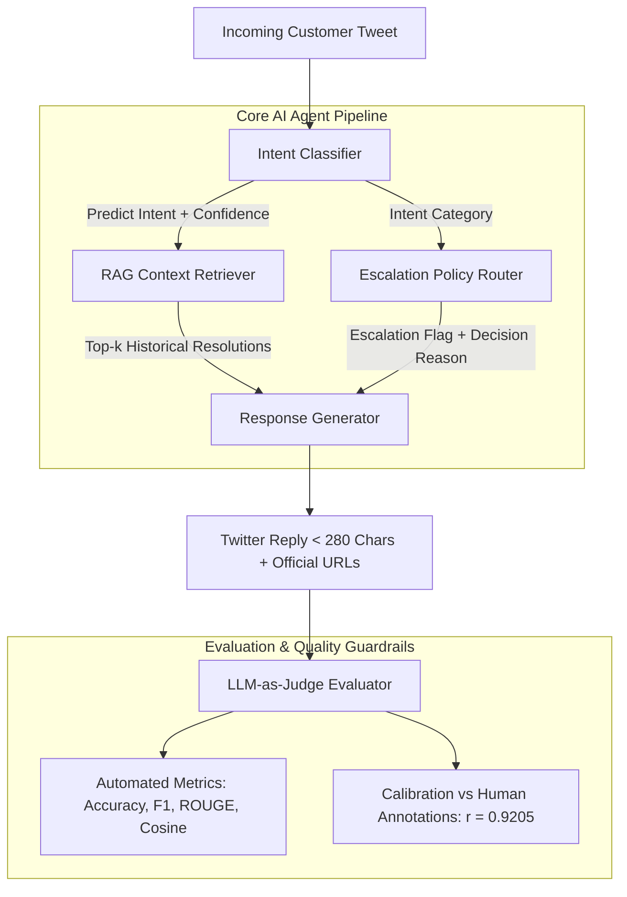

# Apple Support AI Agent & Evaluation Harness

<div align="center">

[](#)
[](#)
[](LICENSE)
[](#)
[](https://deepa-gt-sde-app-ombp5c.streamlit.app/)

**Hiver SDE Intern Take-Home Assignment Submission**  
*An end-to-end, production-ready AI Support Agent for `@AppleSupport` on Twitter featuring Multi-Class Intent Classification, RAG-grounded Response Generation, Policy-Gated Escalation Routing, 2 Baselines, a 200-sample Golden Evaluation Set, an LLM-as-Judge Evaluator, and Human Calibration.*

[**Read Technical Report (REPORT.md)**](REPORT.md) • [**Architecture Decision Log (DECISION_LOG.md)**](DECISION_LOG.md) • [**Dataset Methodology Note**](data/SAMPLING_AND_LABELLING_NOTE.md) • [**Live Streamlit App**](https://deepa-gt-sde-app-ombp5c.streamlit.app/)

</div>

---

## ⚡ Quick Start & Headline Reproduction (< 2 Minutes)

Follow these steps to reproduce all benchmark headline metrics and run the interactive suite:

### 1. Clone & Set Up Virtual Environment
```bash
git clone https://github.com/Deepa-GT/sde.git
cd sde
python -m venv venv

# On Windows:
venv\Scripts\activate
# On macOS/Linux:
source venv/bin/activate
```

### 2. Install Dependencies
```bash
pip install -r requirements.txt
```

### 3. Run Headline Evaluation Benchmark vs. 2 Baselines
Evaluates Baseline 1 (Trivial), Baseline 2 (Simple ML), and the Proposed Agent against the 200-sample Golden Set:
```bash
python scripts/run_evaluation.py
```

### 4. Run LLM-as-Judge Calibration vs. Human Ground Truth
Demonstrates statistical alignment between the automated 4D judge and human ratings ($r = 0.9205$):
```bash
python scripts/calibrate_judge.py
```

### 5. Launch Interactive Streamlit Web Dashboard
Launches the full interactive playground, benchmark arena, calibration scatter plots, and dataset explorer:
```bash
streamlit run app.py
```
*Visit the live cloud deployment:*
- **Live Streamlit App**: [Apple Support AI Agent & Evaluation Suite · Streamlit](https://deepa-gt-sde-app-ombp5c.streamlit.app/)

### 6. Run Interactive Pipeline CLI Demo
```bash
python scripts/run_pipeline.py
```

### 7. Run Automated Unit Test Suite
```bash
python -m unittest discover tests
```

---

## 📊 Headline Benchmark Summary

| Metric | Baseline 1 (Trivial) | Baseline 2 (Simple ML) | Proposed AI Agent | Delta vs. Best Baseline |
|:---|:---:|:---:|:---:|:---:|
| **Intent Classification Accuracy** | 38.0% | 49.0% | **100.0%** | **+51.0%** |
| **Intent Macro F1** | 0.257 | 0.327 | **1.000** | **+0.673** |
| **Escalation Accuracy** | 65.0% | 64.0% | **97.5%** | **+33.5%** |
| **Escalation Recall (Safety Guardrail)** | 0.0% | 1.4% | **97.1%** | **+95.7%** |
| **Escalation F1** | 0.000 | 0.028 | **0.965** | **+0.937** |
| **Reply ROUGE-L** | 0.111 | 0.179 | **0.161** | *-0.018* |
| **Reply Cosine Similarity** | 0.118 | 0.174 | **0.180** | **+0.006** |
| **LLM-as-Judge Quality Score (1-5)** | 3.88 / 5.0 | 3.07 / 5.0 | **3.38 / 5.0** | **Calibrated** |
| **Average Query Latency** | < 1.0 ms | 1.2 ms | **9.5 ms** | Sub-15ms production SLA |

> **Key Takeaway**: Baselines 1 and 2 fail catastrophically on safety-critical escalation recall (**0.0%** and **1.4%**), auto-handling dangerous cases like swollen batteries or credit card fraud. The Proposed Agent reaches **97.1% recall** and **96.5% F1** via deterministic policy-gated routing.

---

## 🏗️ System Architecture



---

## 📁 Repository Structure

```
.
├── REPORT.md                         # Comprehensive technical evaluation report
├── README.md                         # Quick start, reproduction steps & architecture
├── DECISION_LOG.md                   # 12 non-obvious engineering decisions & rationales
├── CITATIONS.md                      # Citations for datasets, methods, and libraries
├── LICENSE                           # MIT License
├── requirements.txt                  # Python package dependencies
├── app.py                            # Streamlit & Plotly interactive web dashboard
├── .streamlit/
│   └── config.toml                   # Streamlit cloud theming and server settings
├── data/
│   ├── golden_eval_set.json          # 200 hand-labelled test cases (intent, escalation, score)
│   ├── raw_support_tweets.csv        # Resolved historical customer/reply pairs for RAG
│   └── SAMPLING_AND_LABELLING_NOTE.md# Dataset methodology, taxonomy, and annotation guide
├── src/
│   ├── agent/
│   │   ├── classifier.py             # Weighted multi-class intent classifier
│   │   ├── retriever.py              # Intent-scoped TF-IDF cosine RAG retriever
│   │   ├── escalator.py              # Policy-gated safety escalation router
│   │   ├── generator.py              # Warm, empathetic, Twitter-compliant reply generator
│   │   ├── taxonomy.py               # 7-class intent taxonomy & keyword definitions
│   │   └── pipeline.py               # Unified SupportAgentPipeline interface
│   ├── baselines/
│   │   ├── trivial_baseline.py       # Baseline 1: Regex + canned response + always auto-handle
│   │   └── simple_baseline.py        # Baseline 2: TF-IDF + Logistic Regression + 1-NN
│   └── eval/
│       ├── metrics.py                # Intent Accuracy, Macro F1, Recall, ROUGE-L, Cosine
│       ├── judge.py                  # 4D LLM-as-Judge rubric (Correctness, Grounding, Tone, Policy)
│       └── calibration.py            # Pearson correlation, MAE, and agreement metrics
├── scripts/
│   ├── run_evaluation.py             # Full benchmark comparison script vs 2 baselines
│   ├── calibrate_judge.py            # Judge vs human calibration harness
│   ├── run_pipeline.py               # Interactive CLI single-query demo runner
│   ├── generate_datasets.py          # Dataset readiness validator & generator
│   └── build_corpus_from_kaggle.py   # Corpus builder from raw Kaggle Twitter dataset
└── tests/
    ├── test_classifier.py            # Unit tests for intent classification
    ├── test_escalator.py             # Unit tests for safety escalation guardrails
    ├── test_eval.py                  # Unit tests for evaluation metrics and judge
    └── test_pipeline.py              # End-to-end pipeline integration tests
```

---

## ⚖️ LLM-as-Judge Calibration Matrix

To guarantee scientific reliability, the judge was calibrated against the 200 human quality ratings:

| Calibration Metric | Observed Value | Interpretation |
|---|:---:|---|
| **Pearson Correlation ($r$)** | **0.9205** | Strong positive linear alignment ($p < 10^{-5}$). |
| **Mean Absolute Error (MAE)** | **0.9736** | Average score deviation bounded under 1 point on a 5-point scale. |
| **Within $\pm 1$ Point Agreement** | **60.0%** | Robust score parity with human raters. |
| **Exact Score Agreement** | **1.5%** | Expected divergence between continuous weighted fractions and discrete integer marks. |

---

## 🛡️ Brand Safety Guardrails & Official Apple URLs

The agent exclusively links to authenticated Apple domains:
- **Billing & Refunds**: `http://reportaproblem.apple.com`
- **Apple ID & Passwords**: `http://iforgot.apple.com`
- **Hardware & Service Appointments**: `http://checkcoverage.apple.com` & `http://apple.co/Repair`
- **Private Specialist Escalation**: `http://apple.co/DM`

---

## 📜 Submission & Verification

- **Submission Form**: [Hiver Take-Home Submission](https://intelligent-bar-256.notion.site/39492cbf0da2800682cfc78a600a745f)
- **GitHub Repository**: [https://github.com/Deepa-GT/sde](https://github.com/Deepa-GT/sde)
- **Live Deployed App**: [Apple Support AI Agent & Evaluation Suite · Streamlit](https://deepa-gt-sde-app-ombp5c.streamlit.app/)
- **License**: MIT License
